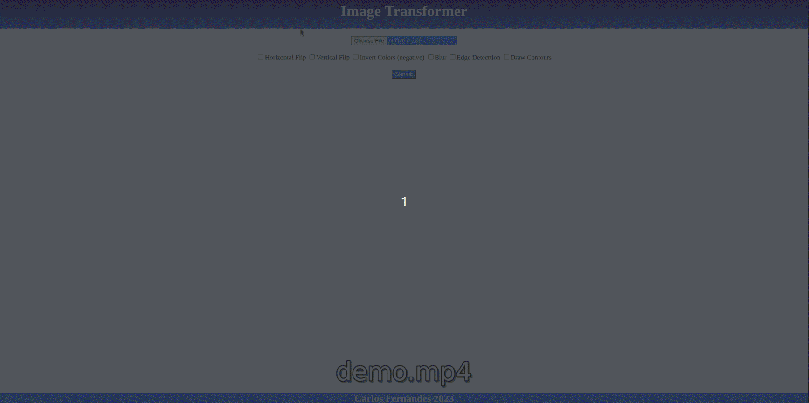

# Image Transformer

This project is based on **Gryfo's FullStack Challenge** that I did back in 2020. The original challenge was to build a REST API using Flask for image processing, with a bare minimum frontend with a multiselect for the operations to perform on the image.

This version is modified as it not only have a REST API, but also a CLI for the image processing. Moreover, for the REST API, there is an **additional challenge of not using any web development frameworks** (for educational purposes).

## Project Sturcture

- CORE -> contains the Image Transformer itself, which is a wrapper for many <a href='https://pypi.org/project/opencv-python/'>Python's OpenCV</a> operations
- UI -> contains the different User Interfaces for interacting with the Image Transformer
  - CLI -> basic command line interface, containing the `transform` command. It also posses a `serve` command for stating the REST API locally
  - API -> REST API built using python's httpd
  - WEB -> static html that invokes the API for image transformation


## Installation

This project uses, <a href='https://python-poetry.org/' target=_blank>**Poetry**</a> as dependency manager. It can be installed with the following command.

> $ pip install poetry

To install the project dependecies in the <a href='./pyproject.toml'>*pyproject.toml*</a> file, run:

> $ poetry install


## Running

For getting started, run the `help` command

> $ python main.py -h

### CLI

For transforming images using the CLI directly, run the `transform` command (use `-h` flag for additional info). This will output the transformed image inside a `output` folder in the same path as the original image.

> python main.py transform -i /path/to/image.png -o edge_detect blur


### API

To start the API, run the `serve` command, which will start the API on `localhost:8000`

> python main.py serve

#### POST image/transform

This endpoint accepts both `form` and `json` requests

for `form` requests, it returns image binary (content-type `image/png`)
```
curl  -X POST \
  'http://localhost:8000/image/transform' \
  --header 'Accept: */*' \
  --form 'operations="edge_detect,invert_colors"' \
  --form 'image=@/path/to/image.png' \
  --output /path/to/save/transformed/image.png
```

for `json` requests, the payload takes the image's **base64** and returns the transformed image in the same format
```
curl  -X POST \
  'http://localhost:8000/image/transform' \
  --header 'Accept: */*' \
  --header 'Content-Type: application/json' \
  --data-raw '{
  "image": "IMAGE_BASE64_STRING...",
  "operations": ['edge_detect,invert_colors']
}'
```

#### WEB UI

Open the <a href='./ui/web/index.html'>index</a> file in your browser of preference and enjoy it :)



**Reminder**: The static web user interface relies on the API running!
